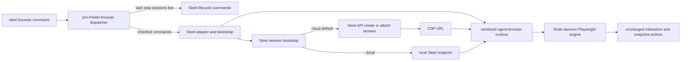

# Steel Browser CLI Implementation Plan

## Scope Lock

- Chosen migration path: **replace immediately** — `steel browser start/stop` switch to cloud-session semantics now.
- Hard constraint: preserve agent-browser command compatibility (`open`, `snapshot`, `click`, etc.) and output formats.
- Upstream strategy: **pristine subtree + thin Steel adapter**.
- Dependency constraint: do not import `@agent-browser/cli` from npm; use vendored subtree/runtime assets.
- Dispatch constraint: inherited browser commands route through a pre-Pastel dispatcher instead of file-per-command Pastel wrappers.
- Performance constraint: avoid additional steady-state command hops and keep bootstrap only on lifecycle boundaries.

## End-State User Interface Contract (PRD Anchor)

- Positioning: `steel browser` is **agent-browser compatible CLI + Steel cloud infrastructure by default**.
- Migration promise: existing scripts should mostly work by replacing `agent-browser` with `steel browser`.
- Auth experience:
  - standard: `steel login` once, no manual key management.
  - CI fallback: `STEEL_API_KEY`.
- Default behavior:
  - no flag: auto-create or attach Steel cloud session, then execute command.
  - `--local`: connect to local Steel runtime (same command semantics).
  - `--auto-connect <url>`: preserved power-user escape hatch to direct CDP endpoint.
  - `steel browser <inherited-command> --help`: delegated to vendored runtime help output.

### User-facing command contract

- **Inherited command family (must remain behaviorally unchanged):**
  - navigation and lifecycle (`open`, `close`, `back`, `forward`, `reload`)
  - interaction (`click`, `fill`, `type`, `press`, `hover`, `select`, `check`, etc.)
  - retrieval (`get text/url/title/html/...`)
  - snapshot and refs (`snapshot`, `diff`, `screenshot --annotate`)
  - waiting/debug/network/storage/device commands supported by upstream.
- **Steel additions (new first-class interface):**
  - `steel browser start [--local] [--session <name>] [--stealth] [--proxy <url>]`
  - `steel browser stop [--all]`
  - `steel browser sessions` (structured JSON list)
  - `steel browser live` (current session live-view URL)

### Output and compatibility guarantees

- For inherited commands: preserve upstream output format and exit-code behavior.
- For Steel additions: output must be stable and machine-parseable where applicable (`sessions` JSON).
- No renaming/removal of inherited command names or core flags in the first release.

### Explicitly deferred, not forgotten

- Profile/upload/download endpoint mappings are deferred from critical path, but listed as post-GA interface work with acceptance criteria.

## V1 Interface Scope (Must Ship vs Defer)

- **Must ship in V1**
  - pre-Pastel browser dispatcher with passthrough of inherited commands and exit behavior.
  - `steel browser` supports inherited core agent-browser workflows with compatible behavior and outputs.
  - default cloud bootstrap on first action command.
  - `steel browser start` and `steel browser stop` with new cloud-session semantics.
  - `steel browser sessions` returns stable JSON schema.
  - `steel browser live` returns current session live-view URL.
  - `--local` mode path available and behaviorally aligned with cloud command semantics.
  - browser commands skip Steel auto-update check path.
  - generated docs remain simple and Steel-owned, with separate static compatibility doc for inherited browser command families.
  - migration path validated for command-prefix swap (`agent-browser` -> `steel browser`).
- **Can defer after V1 (tracked explicitly)**
  - full Rust cross-build matrix in Steel CI (required only if we need patched upstream runtime artifacts).
  - full profile mapping and persistence parity analysis (`--profile` and related semantics).
  - upload/download endpoint mapping and local/remote file materialization policy.
  - deeper non-core feature parity hardening for advanced/edge command families.

## Deep Research Findings (that shape implementation)

- agent-browser is a **hybrid Rust + Node architecture**, not Rust-only. Rust CLI parses flags/commands and sends JSON over socket, but startup still spawns Node daemon:

```text
// agent-browser/cli/src/connection.rs
let mut cmd = Command::new("node");
cmd.arg(daemon_path)
```

- CDP/cloud attach is already first-class in upstream parser/protocol (`launch` supports `cdpUrl` / `cdpPort` and `provider`), so Steel can inject cloud behavior in bootstrap path rather than rewriting interaction primitives.
- In current Steel CLI, `browser` command group is already used for local Docker orchestration, so this PRD requires a command-surface swap:

```ts
// source/commands/browser/start.tsx
export const description = 'Starts Steel Browser in development mode';
```

- Steel auth/config already exists and is reusable (`~/.config/steel/config.json`, `steel login`, `STEEL_API_KEY` fallback patterns): [source/utils/session.ts](source/utils/session.ts), [source/commands/login.tsx](source/commands/login.tsx), [source/utils/constants.ts](source/utils/constants.ts).
- Steel currently routes through Pastel file-based command modules and dynamic docs/help discovery, so inherited command compatibility requires pre-dispatch passthrough instead of trying to mirror every upstream command in `source/commands`: [source/steel.tsx](source/steel.tsx), [source/components/help.tsx](source/components/help.tsx), [scripts/generate-docs.js](scripts/generate-docs.js).
- Steel auto-update checks run before most commands today; browser command paths need an explicit skip to protect cold-path performance: [source/steel.tsx](source/steel.tsx).

## Target Architecture (Performance-First)



## Implementation Phases

### 0) Dispatch boundary and update bypass (first change)

- Add pre-Pastel command routing in [source/steel.tsx](source/steel.tsx):
  - if command path is `steel browser start|stop|sessions|live`, continue into Steel-native command modules.
  - all other `steel browser ...` commands pass through to vendored agent-browser runtime.
- Preserve raw argv, stdout, stderr, and process exit codes for inherited passthrough commands.
- Skip Steel auto-update flow for all browser command paths to avoid cold-start tax.

### 1) Establish subtree + adapter boundary

- Import agent-browser under a dedicated subtree path (for example `third_party/agent-browser/`) and keep it pristine.
- Add a thin adapter in Steel CLI that:
  - routes Steel lifecycle commands (`start/stop/sessions/live`),
  - forwards inherited commands as pass-through,
  - performs one-time session bootstrap before first forwarded action.
- Keep runtime ownership clear: Steel code lives in adapter modules, upstream code lives only in subtree.
- Add an explicit upstream update script and docs (`git subtree pull` workflow + conflict playbook).

### 2) Replace existing `browser start/stop` semantics

- Replace current local Docker start/stop implementations in:
  - [source/commands/browser/start.tsx](source/commands/browser/start.tsx)
  - [source/commands/browser/stop.tsx](source/commands/browser/stop.tsx)
  - [source/commands/browser/index.tsx](source/commands/browser/index.tsx)
- New behavior:
  - `start` => create/attach cloud session by default; support `--local`, `--session`, `--stealth`, `--proxy`.
  - `stop` => stop current session; support `--all`.
- Move old local-orchestration UX into explicit dev-local command namespace (target `steel dev start/stop`) with compatibility note in docs.

### 3) Session bootstrap integration (core change)

- Add a Steel bootstrap module (new utility under `source/utils`) that:
  - resolves auth in one place: `STEEL_API_KEY` first, then config file (`steel login` output).
  - calls Steel API session endpoints (create/list/stop, attach by name).
  - resolves CDP URL and injects launch path once before first interaction command.
- Behavior rules:
  - default: auto-create session on first browser action if none active.
  - `--session <name>`: create-or-attach named persistent session.
  - `--local`: resolve local Steel endpoint from running local instance.
  - no per-command API calls in steady state (unless lifecycle command).
  - lock-safe local active-session state to avoid duplicate create calls in concurrent invocations.

### 4) Steel-specific commands and observability

- Implement:
  - `steel browser sessions` (JSON output contract in PRD)
  - `steel browser live` (prints live view URL for active session)
- Ensure output remains parseable and stable for orchestrators.

### 5) Packaging and CI for vendored runtime (phased)

- Package vendored agent-browser runtime artifacts in this CLI release (no external `@agent-browser/cli` npm dependency).
- Add runtime platform selector to load bundled binary/assets for current OS/arch.
- Extend workflows with multi-OS smoke checks using packaged artifacts:
  - [.github/workflows/npm-publish.yml](.github/workflows/npm-publish.yml)
  - [.github/workflows/release.yml](.github/workflows/release.yml)
- Defer full Rust cross-build matrix until we need to maintain non-trivial upstream patches.

### 6) Performance budgets and regression checks

- Define and enforce initial budgets:
  - cold first action (includes bootstrap): acceptable increase bounded and tracked.
  - warm action latency: near-upstream baseline with minimal adapter overhead.
- Add benchmark commands and CI checks for:
  - `open` cold path,
  - `snapshot -i` warm path,
  - `click` warm path.
- Fail release if warm-path regression exceeds threshold.

### 7) Docs, migration, and launch (simple docs model)

- Keep generated docs focused on Steel-owned commands via existing generator:
  - [docs/cli-reference.md](docs/cli-reference.md)
  - [docs/README.md](docs/README.md)
  - [scripts/generate-docs.js](scripts/generate-docs.js)
- Add static compatibility doc (`docs/browser-compat.md`) for inherited command families, migration notes, and caveats.
- Ensure `steel browser <inherited-command> --help` delegates to vendored runtime help output.
- Add migration doc: `agent-browser` -> `steel browser` find/replace and login setup.
- Add upstream-sync guide (`docs/`): subtree pull cadence and adapter-only conflict policy.

### 8) Deferred mappings (explicitly out of current critical path)

- Track profile/upload/download mapping as deferred complexity:
  - profiles semantics (`--profile` vs Steel session persistence),
  - upload staging behavior,
  - download materialization behavior.
- Document assumptions now; implement after core compatibility + performance gates are green.

## Subtree Strategy Decision

- Chosen: subtree + thin adapter.
- Reasoning:
  - keeps upstream sync tractable (`git subtree pull`) and lowers long-term maintenance cost.
  - preserves agent-browser parity better than a direct in-repo fork with local edits.
  - keeps performance equivalent in steady state while minimizing merge-conflict surface.
- Direct in-repo fork is only acceptable if we intentionally diverge from agent-browser semantics.

## Upstream Sync Policy

- Default rule: no direct edits inside subtree.
- If unavoidable, maintain a small, documented patch queue with owner + reason + rollback plan.
- Keep Steel-specific behavior in adapter modules only, minimizing conflict surface on upstream pulls.

## Validation Gates

- Compatibility tests:
  - golden output checks for representative inherited commands (`open`, `snapshot -i`, `click`, `get text`, `wait`, `screenshot --annotate`).
  - passthrough parity checks for stdout/stderr and exit codes between upstream binary and `steel browser`.
- Session behavior tests:
  - auto-create on first action, named reattach after process restart, local mode parity.
  - auth resolution order (`STEEL_API_KEY` before config) and typed missing-auth failures.
- Performance checks:
  - cold and warm benchmark snapshots compared against baseline.
  - no extra steady-state network calls introduced by adapter.
  - verify browser commands bypass auto-update check path.
- End-interface checks:
  - smoke migration test: `agent-browser` sample script works with `steel browser` after command-prefix swap.
  - Steel-specific UX test: `start/stop/sessions/live` match documented contract and output schemas.
  - packaged runtime smoke tests on Linux/macOS/Windows for key commands.
- Docs/help validation:
  - `npm run docs:generate` reflects Steel-owned browser commands.
  - static compatibility doc is present and linked from CLI docs.
  - inherited command help is delegated (`steel browser <cmd> --help`).

## External References

- agent-browser repository: [vercel-labs/agent-browser](https://github.com/vercel-labs/agent-browser)
- agent-browser README/CLI model and command compatibility baseline: [README.md](https://github.com/vercel-labs/agent-browser/blob/main/README.md)
- agent-browser CLI behavior and flags: [cli/README.md](https://github.com/vercel-labs/agent-browser/blob/main/cli/README.md)
