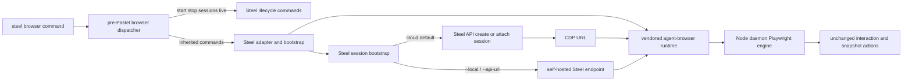

# Steel Browser CLI Implementation Plan

## Scope Lock

- Chosen migration path: **replace immediately** — `steel browser start/stop` switch to cloud-session semantics now.
- Hard constraint: preserve agent-browser command compatibility (`open`, `snapshot`, `click`, etc.) and output formats.
- Upstream strategy: **pristine subtree + thin Steel adapter**.
- Dependency constraint: do not import `@agent-browser/cli` from npm; use vendored subtree/runtime assets.
- Dispatch constraint: inherited browser commands route through a pre-Pastel dispatcher instead of file-per-command Pastel wrappers.
- Endpoint constraint: `--local` selects self-hosted mode; `--api-url <url>` is explicit endpoint override and implies self-hosted mode.
- Performance constraint: avoid additional steady-state command hops and keep bootstrap only on lifecycle boundaries.

## End-State User Interface Contract (PRD Anchor)

- Positioning: `steel browser` is **agent-browser compatible CLI + Steel cloud infrastructure by default**.
- Migration promise: existing scripts should mostly work by replacing `agent-browser` with `steel browser`.
- Auth experience:
  - standard: `steel login` once, no manual key management.
  - CI fallback: `STEEL_API_KEY`.
- Default behavior:
  - no flag: auto-create or attach Steel cloud session, then execute command.
  - `--local`: use self-hosted mode with endpoint resolution (`--api-url` > env/settings > localhost default).
  - `--api-url <url>`: explicit self-hosted API endpoint and implies self-hosted mode.
  - `--cdp <url|port>`: preserved power-user escape hatch to direct CDP endpoint.
  - `--auto-connect`: preserved local Chrome auto-discovery behavior.
  - `steel browser <inherited-command> --help`: delegated to vendored runtime help output.

### User-facing command contract

- **Inherited command family (must remain behaviorally unchanged):**
  - navigation and lifecycle (`open`, `close`, `back`, `forward`, `reload`)
  - interaction (`click`, `fill`, `type`, `press`, `hover`, `select`, `check`, etc.)
  - retrieval (`get text/url/title/html/...`)
  - snapshot and refs (`snapshot`, `diff`, `screenshot --annotate`)
  - waiting/debug/network/storage/device commands supported by upstream.
- **Steel additions (new first-class interface):**
  - `steel browser start [--local] [--api-url <url>] [--session <name>] [--stealth] [--proxy <url>]`
  - `steel browser stop [--all] [--local] [--api-url <url>]`
  - `steel browser sessions [--local] [--api-url <url>]` (structured JSON list)
  - `steel browser live [--local] [--api-url <url>]` (current session live-view URL)
  - `steel dev install` (explicit local Steel runtime install/bootstrap)
  - `steel dev start` / `steel dev stop` (local runtime lifecycle only)

### Output and compatibility guarantees

- For inherited commands: preserve upstream output format and exit-code behavior.
- For Steel additions: output must be stable and machine-parseable where applicable (`sessions` JSON).
- No renaming/removal of inherited command names or core flags in the first release.

### Explicitly deferred, not forgotten

- Profile/upload/download endpoint mappings are deferred from critical path, but listed as post-GA interface work with acceptance criteria.

## Release-Cut Decisions (February 25, 2026)

- Prioritize release-critical work before perf benchmarking:
  - keep authenticated cloud smoke + compatibility as release blocker.
  - delegate perf benchmark workstream to post-release hardening; keep scope documented, but non-release-blocking in this cut.
- Adopt explicit self-hosted endpoint targeting:
  - `--api-url <url>` on browser lifecycle + passthrough commands.
  - `--api-url` implies self-hosted mode.
  - `--local` remains as self-hosted mode selector.
- Add explicit local runtime installation command:
  - `steel dev install` installs/bootstrap local runtime assets.
  - `steel dev start/stop` remain runtime lifecycle commands.
- Keep compatibility-first default:
  - inherited commands stay passthrough.
  - `--cdp` and `--auto-connect` continue to bypass Steel bootstrap injection.

### Endpoint Resolution Contract (Implementation Spec)

- Mode selection rules:
  - if passthrough command includes `--cdp` or `--auto-connect`, skip bootstrap and forward untouched.
  - else if `--api-url` is present, run in self-hosted mode.
  - else if `--local` is present, run in self-hosted mode.
  - else run in cloud mode.
- Self-hosted API base URL precedence:
  - `--api-url <url>`
  - `STEEL_BROWSER_API_URL` (new canonical env var)
  - `STEEL_LOCAL_API_URL` (backward-compatible alias)
  - persisted setting (target key: `browser.apiUrl` in `~/.config/steel/config.json`)
  - fallback: `http://localhost:3000/v1`
- Cloud API base URL precedence:
  - `STEEL_API_URL`
  - fallback: `https://api.steel.dev/v1`
- Validation behavior:
  - if `--api-url` is invalid URL, fail fast with typed `INVALID_BROWSER_ARGS`.
  - if both `--cdp` and `--auto-connect` are provided, fail fast (existing behavior preserved).
  - `--api-url` cannot override explicit `--cdp` or `--auto-connect`; those keep passthrough semantics.

### Local Runtime UX Contract (Implementation Spec)

- New command:
  - `steel dev install [--repo-url <git-url>] [--verbose]`
- Command responsibilities:
  - ensure local runtime repo/assets exist at configured path.
  - do not start Docker containers.
  - be idempotent: repeated runs should succeed without re-cloning unless missing/corrupt.
  - print stable machine-readable fields (at minimum: `repo_path`, `repo_url`).
- `steel dev start` behavior:
  - start local runtime containers only.
  - if runtime repo/assets are missing, return actionable guidance to run `steel dev install`.
- `steel browser ... --local` behavior (localhost endpoint):
  - if runtime appears uninstalled, show guidance for `steel dev install`.
  - if runtime installed but not running, show guidance for `steel dev start`.
  - do not silently clone/install from browser action commands.

## V1 Interface Scope (Must Ship vs Defer)

- **Must ship in V1**
  - pre-Pastel browser dispatcher with passthrough of inherited commands and exit behavior.
  - `steel browser` supports inherited core agent-browser workflows with compatible behavior and outputs.
  - default cloud bootstrap on first action command.
  - `steel browser start` and `steel browser stop` with new cloud-session semantics.
  - `steel browser sessions` returns stable JSON schema.
  - `steel browser live` returns current session live-view URL.
  - `--local` mode path available and behaviorally aligned with cloud command semantics.
  - explicit self-hosted endpoint targeting via `--api-url`, with deterministic env/settings fallback order.
  - `steel dev install` command for explicit local runtime setup (`dev start/stop` remain runtime lifecycle only).
  - browser commands skip Steel auto-update check path.
  - generated docs remain simple and Steel-owned, with separate static compatibility doc for inherited browser command families.
  - migration path validated for command-prefix swap (`agent-browser` -> `steel browser`).
- **Can defer after V1 (tracked explicitly)**
  - perf benchmark workstream (cold/warm budgets + enforcement thresholds) delegated to post-release hardening.
  - full Rust cross-build matrix in Steel CI (required only if we need patched upstream runtime artifacts).
  - full profile mapping and persistence parity analysis (`--profile` and related semantics).
  - upload/download endpoint mapping and local/remote file materialization policy.
  - deeper non-core feature parity hardening for advanced/edge command families.

## Deep Research Findings (that shape implementation)

- agent-browser is a **hybrid Rust + Node architecture**, not Rust-only. Rust CLI parses flags/commands and sends JSON over socket, but startup still spawns Node daemon:

```text
// agent-browser/cli/src/connection.rs
let mut cmd = Command::new("node");
cmd.arg(daemon_path)
```

- CDP/cloud attach is already first-class in upstream parser/protocol (`launch` supports `cdpUrl` / `cdpPort` and `provider`), so Steel can inject cloud behavior in bootstrap path rather than rewriting interaction primitives.
- In current Steel CLI, `browser` command group is already used for local Docker orchestration, so this PRD requires a command-surface swap:

```ts
// source/commands/browser/start.tsx
export const description = 'Starts Steel Browser in development mode';
```

- Steel auth/config already exists and is reusable (`~/.config/steel/config.json`, `steel login`, `STEEL_API_KEY` fallback patterns): [source/utils/session.ts](source/utils/session.ts), [source/commands/login.tsx](source/commands/login.tsx), [source/utils/constants.ts](source/utils/constants.ts).
- Steel currently routes through Pastel file-based command modules and dynamic docs/help discovery, so inherited command compatibility requires pre-dispatch passthrough instead of trying to mirror every upstream command in `source/commands`: [source/steel.tsx](source/steel.tsx), [source/components/help.tsx](source/components/help.tsx), [scripts/generate-docs.js](scripts/generate-docs.js).
- Steel auto-update checks run before most commands today; browser command paths need an explicit skip to protect cold-path performance: [source/steel.tsx](source/steel.tsx).

## E2E Smoke Findings (February 25, 2026)

- Auth and Steel cloud lifecycle path is confirmed: `steel browser start --session <name>` successfully created sessions and returned ids/live URLs.
- Resolved gaps:
  - adapter bootstrap now injects `--cdp <url>` for Steel session endpoints, preserves bare `--auto-connect` discovery mode, and rejects mixed explicit attach flags.
  - vendored runtime package now includes upstream daemon JS assets (`dist/`) and auto-sets `AGENT_BROWSER_HOME` for vendored runtime execution.
- Added authenticated smoke harness: `npm run browser:cloud:smoke` validates `start -> open -> snapshot -i -> stop` plus direct-runtime parity checks when `STEEL_API_KEY` is set.
- Remaining release gates:
  - completed February 26, 2026: `browser:cloud:smoke` passed in a credentialed environment (`Passed authenticated flow for session 1dd46eb4-3b8d-495e-8dd4-4873f20397ce`).
  - completed February 26, 2026: endpoint-targeting contract (`--api-url` + env/settings precedence) implemented and validated for self-hosted deployments.
  - completed February 26, 2026: migration docs for cloud vs self-hosted mode selection and `steel dev install` flow published.

## Target Architecture (Performance-First)



## Implementation Phases

### 0) Dispatch boundary and update bypass (first change)

- Add pre-Pastel command routing in [source/steel.tsx](source/steel.tsx):
  - if command path is `steel browser start|stop|sessions|live`, continue into Steel-native command modules.
  - all other `steel browser ...` commands pass through to vendored agent-browser runtime.
- Preserve raw argv, stdout, stderr, and process exit codes for inherited passthrough commands.
- Skip Steel auto-update flow for all browser command paths to avoid cold-start tax.

### 1) Establish subtree + adapter boundary

- Import agent-browser under a dedicated subtree path (for example `third_party/agent-browser/`) and keep it pristine.
- Add a thin adapter in Steel CLI that:
  - routes Steel lifecycle commands (`start/stop/sessions/live`),
  - forwards inherited commands as pass-through,
  - performs one-time session bootstrap before first forwarded action.
- Keep runtime ownership clear: Steel code lives in adapter modules, upstream code lives only in subtree.
- Add an explicit upstream update script and docs (`git subtree pull` workflow + conflict playbook).

### 2) Replace existing browser lifecycle semantics

- Replace current local Docker start/stop implementations in:
  - [source/commands/browser/start.tsx](source/commands/browser/start.tsx)
  - [source/commands/browser/stop.tsx](source/commands/browser/stop.tsx)
  - [source/commands/browser/index.tsx](source/commands/browser/index.tsx)
- New behavior:
  - `start` => create/attach cloud session by default; support `--local`, `--api-url`, `--session`, `--stealth`, `--proxy`.
  - `stop` => stop current session; support `--all`, `--local`, `--api-url`.
  - `sessions` and `live` => accept `--local`, `--api-url` for explicit mode/endpoint targeting.
- Keep inherited commands untouched and routed through passthrough path.

### 3) Session bootstrap integration + endpoint targeting (core change)

- Add a Steel bootstrap module (new utility under `source/utils`) that:
  - resolves auth in one place: `STEEL_API_KEY` first, then config file (`steel login` output).
  - calls Steel API session endpoints (create/list/stop, attach by name).
  - resolves CDP URL and injects upstream-compatible launch flags once before first interaction command.
- Behavior rules:
  - default: auto-create session on first browser action if none active.
  - `--session <name>`: create-or-attach named persistent session.
  - `--local`: run in self-hosted mode with endpoint precedence from the contract.
  - `--api-url <url>`: explicit self-hosted endpoint override and implies self-hosted mode.
  - inject `--cdp <url>` for Steel-resolved remote endpoints; reserve bare `--auto-connect` for discovery mode.
  - if caller already provides `--cdp` or `--auto-connect`, do not inject a conflicting attach flag.
  - no per-command API calls in steady state (unless lifecycle command).
  - lock-safe local active-session state to avoid duplicate create calls in concurrent invocations.
- Engineering details for next implementation pass:
  - extend passthrough bootstrap parser to support `--api-url`.
  - add a single endpoint resolver utility used by lifecycle commands and passthrough bootstrap.
  - implement precedence exactly as documented in `Endpoint Resolution Contract (Implementation Spec)`.
  - preserve existing typed errors for bad flag combinations, and add typed validation for malformed `--api-url`.

### 4) Local runtime command surface (`steel dev`)

- Add explicit install command:
  - `steel dev install [--repo-url <git-url>] [--verbose]`.
- Refactor dev-local utilities so responsibilities are explicit:
  - install/bootstrap (`dev install`),
  - start containers (`dev start`),
  - stop containers (`dev stop`).
- Preserve current repo location defaults unless explicitly overridden.
- Ensure `browser --local` on localhost gives clear action guidance:
  - missing runtime assets => suggest `steel dev install`,
  - runtime not running => suggest `steel dev start`.
- Do not auto-install/clone from browser action commands.

### 5) Steel-specific commands and observability

- Implement:
  - `steel browser sessions` (JSON output contract in PRD)
  - `steel browser live` (prints live view URL for active session)
- Ensure output remains parseable and stable for orchestrators.

### 6) Packaging and CI for vendored runtime (phased)

- Package vendored agent-browser runtime artifacts in this CLI release (no external `@agent-browser/cli` npm dependency).
- Add runtime platform selector to load bundled binary/assets for current OS/arch.
- Extend workflows with multi-OS smoke checks using packaged artifacts:
  - [.github/workflows/npm-publish.yml](.github/workflows/npm-publish.yml)
  - [.github/workflows/release.yml](.github/workflows/release.yml)
- Defer full Rust cross-build matrix until we need to maintain non-trivial upstream patches.

### 7) Compatibility and smoke validation (release-critical)

- Keep authenticated smoke as hard gate:
  - `npm run browser:cloud:smoke` must pass in credentialed env.
- Add/retain integration coverage for:
  - lifecycle flow (`start -> open -> snapshot -i -> stop`),
  - passthrough parity (stdout/stderr/exit codes),
  - endpoint targeting behavior (`--api-url`, env fallback, settings fallback),
  - localhost guidance behavior (`dev install` / `dev start` hints).

### 8) Performance budgets and regression checks (delegated to post-release hardening)

- Keep this workstream explicitly delegated and non-release-blocking for the current cut.
- Define and enforce initial budgets:
  - cold first action (includes bootstrap): acceptable increase bounded and tracked.
  - warm action latency: near-upstream baseline with minimal adapter overhead.
- Add benchmark commands and CI checks for:
  - `open` cold path,
  - `snapshot -i` warm path,
  - `click` warm path.
- Fail release if warm-path regression exceeds threshold.

### 9) Docs, migration, and launch (simple docs model)

- Keep generated docs focused on Steel-owned commands via existing generator:
  - [docs/cli-reference.md](docs/cli-reference.md)
  - [docs/README.md](docs/README.md)
  - [scripts/generate-docs.js](scripts/generate-docs.js)
- Add static compatibility doc (`docs/browser-compat.md`) for inherited command families, migration notes, and caveats.
- Ensure `steel browser <inherited-command> --help` delegates to vendored runtime help output.
- Add migration doc: `agent-browser` -> `steel browser` find/replace and login setup.
- Add endpoint/mode doc for users and agents:
  - cloud default,
  - self-hosted mode via `--local` and `--api-url`,
  - env + settings precedence,
  - local runtime lifecycle via `steel dev install/start/stop`.
- Add upstream-sync guide (`docs/`): subtree pull cadence and adapter-only conflict policy.

### 10) Deferred mappings (explicitly out of current critical path)

- Track profile/upload/download mapping as deferred complexity:
  - profiles semantics (`--profile` vs Steel session persistence),
  - upload staging behavior,
  - download materialization behavior.
- Document assumptions now; implement after core compatibility + performance gates are green.

## Subtree Strategy Decision

- Chosen: subtree + thin adapter.
- Reasoning:
  - keeps upstream sync tractable (`git subtree pull`) and lowers long-term maintenance cost.
  - preserves agent-browser parity better than a direct in-repo fork with local edits.
  - keeps performance equivalent in steady state while minimizing merge-conflict surface.
- Direct in-repo fork is only acceptable if we intentionally diverge from agent-browser semantics.

## Upstream Sync Policy

- Default rule: no direct edits inside subtree.
- If unavoidable, maintain a small, documented patch queue with owner + reason + rollback plan.
- Keep Steel-specific behavior in adapter modules only, minimizing conflict surface on upstream pulls.

## Validation Gates

- Compatibility tests:
  - golden output checks for representative inherited commands (`open`, `snapshot -i`, `click`, `get text`, `wait`, `screenshot --annotate`).
  - passthrough parity checks for stdout/stderr and exit codes between upstream binary and `steel browser`.
- Session behavior tests:
  - auto-create on first action, named reattach after process restart, local mode parity.
  - auth resolution order (`STEEL_API_KEY` before config) and typed missing-auth failures.
- Endpoint targeting tests:
  - `--api-url` implies self-hosted mode and overrides env/settings/defaults.
  - precedence order is deterministic (`--api-url` > `STEEL_BROWSER_API_URL` > `STEEL_LOCAL_API_URL` > config > localhost).
  - explicit attach flags (`--cdp`, `--auto-connect`) bypass bootstrap and are not modified.
- Local runtime UX tests:
  - `steel dev install` is idempotent and does not start Docker containers.
  - `steel dev start` errors clearly when runtime assets are missing and points to `steel dev install`.
  - localhost `browser --local` failures include actionable install/start guidance.
- Performance checks (tracked, not release-blocking in this cut):
  - cold and warm benchmark snapshots compared against baseline.
  - no extra steady-state network calls introduced by adapter.
  - verify browser commands bypass auto-update check path.
- End-interface checks:
  - smoke migration test: `agent-browser` sample script works with `steel browser` after command-prefix swap.
  - authenticated smoke test: `start -> open -> snapshot -i -> stop` passes using Steel cloud with no external runtime env hacks.
  - Steel-specific UX test: `start/stop/sessions/live` match documented contract and output schemas.
  - packaged runtime smoke tests on Linux/macOS/Windows for key commands.
- Docs/help validation:
  - `npm run docs:generate` reflects Steel-owned browser commands.
  - README includes explicit cloud vs self-hosted mode and endpoint precedence for users/agents.
  - static compatibility doc is present and linked from CLI docs.
  - inherited command help is delegated (`steel browser <cmd> --help`).

## External References

- agent-browser repository: [vercel-labs/agent-browser](https://github.com/vercel-labs/agent-browser)
- agent-browser README/CLI model and command compatibility baseline: [README.md](https://github.com/vercel-labs/agent-browser/blob/main/README.md)
- agent-browser CLI behavior and flags: [cli/README.md](https://github.com/vercel-labs/agent-browser/blob/main/cli/README.md)
